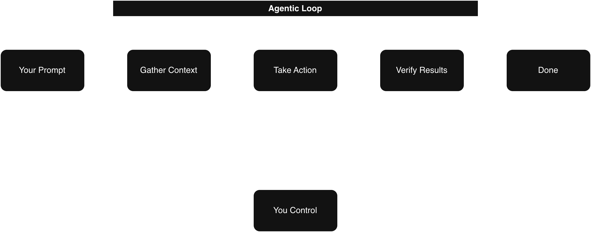

We use Claude Code extensively nowadays. Similar tools also exist, such as GitHub Copilot and OpenCode. This tutorial focuses on Claude Code, how it can complement your development workflow, and how to manage context effectively within Claude Code. Let’s dive deeper into what Claude Code is and how it works.

## What Claude Code is?

Claude Code is an agent that understands your codebase, edits files, runs commands, and integrates with your existing developer tools to help you build software faster and more efficiently.

### Why It is called as agent?

Before understanding Claude Code, let’s first understand what an agent is.

An agent is a system that understands the information or instructions provided by a user and takes action based on that information. The action could be running commands, creating files, modifying code, or even deploying an entire system. Depending on the level of autonomy provided, the agent may either perform actions directly or ask for approval before executing them.

Now let’s understand why Claude Code is considered an agent.

You interact with Claude Code by providing information about your codebase and describing what you want to build, improve, or fix. Based on those instructions, it can create files, edit existing files, run commands, execute tests, and attempt to implement the requested functionality. Since it takes actions based on the information you provide, it fits the definition of an agentic system.

We will discuss agents, how they work, and the role of LLMs in more detail in another article. For now, it is enough to understand why Claude Code is categorized as an agent.

### How Claude Code or any other code agent working

Let’s understand what makes Claude Code different from a traditional chatbot. The workflow of Claude Code is demonstrated below:

The above diagram shows that you first provide a prompt. The agent then gathers the relevant context around the request, decides what actions need to be taken, performs those actions, verifies the results, and completes the loop once the objective is achieved.

You might now wonder why the verification loop exists and why the agent needs to gather context repeatedly. Let’s understand this with a simple example of writing a “Hello World” program.

When solving a problem as a human, you usually already know the expected outcome. You either make assumptions or ask for clarification if something is missing. Similarly, your prompt tells the agent what needs to be achieved. If information is missing, the agent either makes assumptions or asks for clarification.

Next, you begin implementing the solution. You write the code, compile it, run it, and check whether the output matches the expected result. If something is wrong, you fix the issue and try again until the desired result is achieved.

An agentic loop works in a very similar way. It continuously gathers context, performs actions, verifies outcomes, and iterates until the goal is completed successfully.

Although the entire flow is executed by the agent, it does not mean the human is out of the loop. You can observe the process, guide decisions, interrupt execution, and retain full control throughout the workflow.

#### Agent Autonomy

Since you remain in control, you can decide how much autonomy to provide to the agent and which actions require your approval.

Claude Code supports multiple autonomy modes:

- **Default behavior:** Claude asks for explicit permission before editing a file or running a shell command.
- **Auto-accept:** Files are edited without asking, but commands still require approval.
- **Plan mode:** Uses read-only tools to compile a plan of action before starting any work.

## Working with Coding agent

To work effectively with any coding agent, it helps to follow a structured process. Think about how humans typically approach work before starting implementation:

1. Understand the scope of work
2. Identify constraints and assumptions
3. Clarify available tools and processes
4. Plan the work
5. Execute the implementation
6. Achieve the desired results
7. Review the work, since a fresh perspective often catches mistakes or biases

Now let’s categorize these steps into broader phases.

Steps 1, 2, and 3 belong to the **exploration** phase. This is where prompts are formed and the required context is collected.

Step 4 belongs to the **planning** phase, where the implementation approach is designed and reviewed before execution.

Steps 5 and 6 belong to the **execution** phase, where the actual implementation and verification happen.

Step 7 belongs to the **review** phase, where the final output and code quality are validated. Sometimes this review can even be delegated to another agent that was not involved in writing the code, helping reduce bias.

The workflow can be summarized in the following framework:
| Task | Human Responsibility | Agent Responsibility |
|---------|-------------------------------------------------------------|-------------------------------------------------------|
| Explore | Provide requirements, context, and research goals | Gather context and perform research |
| Plan | Review, approve, reject, or modify the proposed plan | Prepare and present the implementation plan |
| Execute | Provide autonomy or guide execution when necessary | Implement the solution following the agentic workflow |
| Review | Review the code and results, or ask another agent to review | Perform reviews or delegate review tasks if requested |

#### Tips to work effectively with agent

- **Define a success criteria.** For Claude to be confident in its results, it needs to be clear on what "correct" looks like. Make this explicit when writing your plan.
- **Add tools.** Tools that help Claude complete its goals remove a lot of back and forth. For example, if you're building web UIs, install the Claude in Chrome extension so Claude Code can control a browser tab and test the UI directly.
- **Include a test suite.** Give Claude a test suite it can continuously validate against. Claude can even write tests for you. Before handing this off, make sure the tests are a reliable source of truth to avoid false positives.

## Context management

First, let’s understand what context and context management mean.

Context is the information a tool can access or remember at a given time. Humans maintain context through memory. Similarly, coding agents maintain context during a session, but their context is limited. The context is built from the prompts you provide, files the agent reads, tool calls it performs, and any additional information gathered while completing tasks.

Since the available context window is limited, managing it properly becomes important. Below are some common techniques used for context management:

- By default, when the context window approaches its limit, Claude Code automatically compacts the context. Compaction summarizes important details and removes unnecessary tool-call results to free up space. However, this process can sometimes cause loss of finer details.
- Another approach is to store information externally and retrieve it when needed using RAG (Retrieval-Augmented Generation). While this helps reduce context pressure, it can increase latency. Additionally, when new information is brought into the context window through RAG, older details already present in the context may be removed.
- Context compaction does not always need to happen automatically. You can manually trigger it using the `/compact` command. Use `/compact` when you are working on a specific feature, approaching the context limit, and still need to continue. Keeping the context focused on the current task is important.
- To completely clear the current context, use `/clear`. This is useful when starting a new feature or workflow, where you do not want previous conversations or assumptions to introduce bias.
- To monitor current context usage and memory, use `/context`.

#### Tips for Better Context Management

- **Be specific.** A vague prompt may appear smaller, but it usually consumes more context over time because the agent needs additional clarification and exploration.
- **Manage your MCP servers carefully.** MCP servers load all their available tools into context by default, even if those tools are not actively being used. If certain servers are unrelated to the current project, consider disabling them.
- You can also use **Skills**, which work similarly to MCP servers but do not load everything into context upfront.
- **Use subagents.** Subagents run in parallel with the main agent but maintain separate context windows. A subagent performs its assigned work independently and returns only a summarized result to the primary agent, helping keep the main context clean and focused.

### Context Management Tools

#### The `CLAUDE.md` File

Before understanding what `CLAUDE.md` does, let’s first understand the problem it solves.

When you open Claude Code without a `CLAUDE.md` file, every session starts from scratch. Claude Code needs to re-explore the codebase, identify dependencies, understand the project structure, and determine which features are already implemented. During this process, it may make assumptions, which can make it harder to guide Claude effectively.

This process also consumes a significant number of tokens repeatedly, since the same project information must be rediscovered in every session.

`CLAUDE.md` solves this problem. It is a Markdown file placed at the root of your project, and Claude Code automatically reads it whenever a new session starts. You can think of it as an onboarding guide for your codebase. The contents of the `CLAUDE.md` file are automatically appended to your prompt. Using a `CLAUDE.md` file helps reduce unnecessary token usage by providing important project context upfront.

There are multiple ways to maintain `CLAUDE.md` files, and each serves a different purpose.

1. **Project-Level Configuration**  
   These are team-shared instructions specific to a project. They help ensure all contributors and agents follow the same standards and project conventions.

   You can create the file in either of the following locations:
   - `<Project Root Directory>/CLAUDE.md`
   - `<Project Root Directory>/.claude/CLAUDE.md`

2. **User-Level Configuration**  
   These are personal preferences that apply either globally across projects or only to specific local projects.

   ##### 2.1 Personal Preferences for All Projects

   These are global preferences applied across every project you work on.

   Common use cases:
   - Code styling preferences
   - Personal tooling shortcuts
   - Preferred workflows or conventions

   File location:
   - `~/.claude/CLAUDE.md`

   ##### 2.2 Personal Project-Specific Preferences

   These are local preferences specific to your personal environment for a particular project. Since they may contain private or environment-specific information, they should usually be added to `.gitignore`.

   Common use cases:
   - Sandbox URLs
   - Preferred test data
   - Local development instructions
   - Personal debugging workflows

   File location:
   - `<Project Root Directory>/CLAUDE.local.md`

#### Subagents

Claude can delegate tasks to subagents, which helps break down complex work into smaller tasks that can run in parallel. This improves both efficiency and context management.

Subagents are specialized assistants that operate using their own independent context windows. Each subagent receives information from two primary sources:

1. A custom system prompt defined in its configuration
2. A task description provided by the parent agent

Once initialized, the subagent works autonomously within its own context window. After completing the assigned task, it returns a summarized result back to the main agent. This approach helps keep the primary agent’s context focused and prevents unnecessary context pollution.

Claude provides three built-in subagents:

1. **General Purpose** – Used for common tasks and general execution workflows.
2. **Explore** – Focused on gathering context, analyzing codebases, and researching information.
3. **Plan** – Focused on creating implementation plans and execution strategies during planning.

We will explore how to create custom subagents in a separate article.

#### Skills

A skill is a Markdown-based capability that teaches Claude how to perform a specific task once, after which Claude can automatically apply that knowledge whenever it becomes relevant.

Agent skills are collections of instructions, scripts, and resources that agents can discover and use to perform tasks more accurately and efficiently. Similar to `CLAUDE.md`, skills can be created in different locations depending on who needs access to them.

1. **Personal Skills**  
   Skills available across all your projects and environments.

   File location:
   - `~/.claude/skills/<skill_name>/<skill_files>`

2. **Project Skills**  
   Skills specific to a particular project and shared within that project’s context.

   File location:
   - `<Project Root Directory>/.claude/skills/<skill_name>/<skill_files>`

The main difference between `CLAUDE.md` and Skills is how they are loaded into context:

- `CLAUDE.md` is loaded into every conversation automatically. It is best suited for rules, conventions, and instructions that should always be followed.
- Skills are loaded only when they are relevant to the current request. This makes them more efficient for specialized or task-specific knowledge.

Skills are particularly useful for:

- Reusable workflows
- Specialized domain knowledge
- Project-specific automation
- Complex operational procedures
- Repetitive engineering tasks

We will explore how to create and structure Skills in a separate article.

#### MCP (Model Context Protocol)

Model Context Protocol (MCP) is an open standard that allows AI agents to connect with external tools and data sources. A large portion of useful context often exists outside the codebase — such as in databases, productivity tools, APIs, documentation systems, or public repositories. MCP helps bridge that gap by allowing agents to access and interact with those external systems.

To better understand MCP, it is important to first understand the concept of _tools_ in agentic AI.

Tools give agents like Claude Code the ability to perform actions beyond reading and generating text. These actions may include:

- Accessing databases
- Calling APIs
- Querying external services
- Reading documentation systems
- Managing repositories
- Running workflows or automations

By using tools, agents can complete tasks more effectively and operate with real-world context and capabilities.

##### Adding an MCP Server to Claude Code

Claude Code supports multiple types of MCP servers depending on how the service is hosted.

1. **HTTP-based MCP Server**  
   HTTP servers are remote services hosted externally and accessed over the network.

   Command:
   `claude mcp add --transport http <mcp_name> <mcp_server_url>`

2. **Stdio-based MCP Server**  
   Stdio servers run as local processes on your machine and communicate through standard input/output streams.

   Command:
   `claude mcp add --transport stdio <mcp_name> -- python <script>`

To manage configured MCP servers, use the `/mcp` command inside Claude Code.

##### MCP Server Scopes

MCP servers can be configured with different scopes depending on who should have access to them.

- **Local Scope**  
  Available only in the current project for your personal use. Since this configuration is user-specific, it is generally recommended to keep it out of version control and added in .gitignore.

  File location:
  - `<Project Root Directory>/.claude.json`

- **User Scope**  
  Available across all your projects and environments.

  File location:
  - `~/.claude.json`

- **Project Scope**  
  Shared with everyone working on the project through version control. This ensures all contributors use the same MCP configuration.

  File location:
  - `<Project Root Directory>/.mcp.json`

You can explicitly define the scope while adding an MCP server.

Example:
`claude mcp add --transport http <mcp_name> --scope local <mcp_server_url>`

##### Important Consideration for Context Management

MCP servers add tool definitions and metadata into the agent’s context window, even when the tools are not actively being used.

Because of this, overusing MCP servers or enabling unnecessary ones can consume valuable context space and reduce overall context efficiency. It is a good practice to enable only the MCP servers relevant to your current workflow or project.

#### Hooks

Hooks allow you to run commands at specific points in Claude Code’s lifecycle.

The key difference between hooks and the other mechanisms discussed so far is that hooks are deterministic — they always execute when the configured event occurs. Hooks ensure that certain actions happen every single time without exception.

Common use cases include:

- Auto-formatting code after file edits
- Logging executed commands for auditing or compliance
- Blocking dangerous operations, such as modifying production files
- Sending notifications when Claude finishes a task

Hooks are configured in `settings.json`. You define:

- The event to listen for
- An optional matcher to restrict which tools trigger the hook
- The command that should execute

##### Available Hook Events

Claude Code supports the following hook events:

- **PreToolUse** — Runs before a tool call is executed
- **PostToolUse** — Runs after a tool call completes
- **UserPromptSubmit** — Runs after you submit a prompt but before Claude processes it
- **Stop** — Runs when Claude finishes responding
- **Notification** — Runs when Claude sends a notification

Hooks can be configured using the `/hooks` command inside Claude Code or by directly editing the `settings.json` file.

##### Blocking Actions with `PreToolUse`

`PreToolUse` hooks can block tool calls before they execute.

The hook receives:

- The tool name
- Tool input as JSON through `stdin`

The hook behavior depends on the command’s exit code:

- **Exit code `0`** — Proceed normally
- **Exit code `2`** — Block the action. The `stderr` message is sent back to Claude as feedback so it understands why the action was blocked and can adjust accordingly.
- **Any other exit code** — Treated as a non-blocking error. The error is shown to the user, but execution continues.

This mechanism is particularly useful for enforcing hard rules and safety checks within workflows.

##### Hook Scopes

Hooks can be configured with different scopes depending on who should have access to them and where the configuration should apply.

- **Local Scope**  
  Available only in the current project for your personal use. Since this configuration is user-specific, it is generally recommended to exclude it from version control and add it to `.gitignore`.

  File location:
  - `<Project Root Directory>/.claude/settings.local.json`

- **User Scope**  
  Available across all your projects and environments. This is useful for personal workflows, reusable automations, or globally preferred hooks.

  File location:
  - `~/.claude/settings.json`

- **Project Scope**  
  Shared with everyone working on the project through version control. This ensures all contributors use the same hook configuration and workflow rules.

  File location:
  - `<Project Root Directory>/.claude/settings.json`

### Summary for Context Management

- Use `CLAUDE.md` when you want Claude Code to always remember project rules, architecture, workflows, and conventions across every session.
- Use Subagents when you want to split complex tasks into isolated parallel workflows without polluting the main context window.
- Use Skills for reusable, task-specific knowledge or workflows that should load only when relevant instead of every session.
- Use MCP when Claude Code needs to interact with external systems such as APIs, databases, documentation platforms, or productivity tools.
- Use Hooks when you want deterministic automation or enforcement that must execute every single time on specific lifecycle events.

## Conclusion

Claude Code is more than just a code-generation tool. It is an agentic development assistant that can understand context, plan tasks, execute workflows, and integrate with external systems.

Using Claude Code effectively is not only about writing better prompts, but also about managing context properly and choosing the right tools for the right problems. Features such as `CLAUDE.md`, Skills, Subagents, MCP, and Hooks each solve different challenges and become more powerful when used together.

As coding agents continue to evolve, understanding these concepts will help you build faster, reduce repetitive work, and create more reliable development workflows.

In upcoming articles, we will explore custom subagents, Skills, MCP servers, Hooks, and advanced agentic development patterns in more detail.
